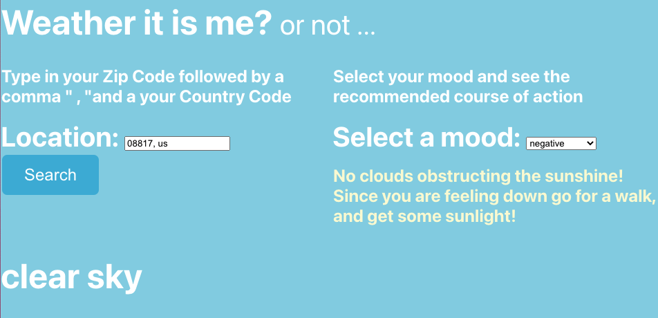

# Description: Weather it is me?

Wellness app that takes basic mood/weather data and gives recommendation based off the data.

## Technologies Used:

- JavaScript
- HTML
- CSS
- React
- Open Weather Map API

## Getting Started/Installation Instructions:

- Fork and clone the repository
- cd to the name of the repo
- install dependencies for react app
- openweathermap.org: Sign up and get your API key
- use your API key in the Location.js
- npm start

## Contribution guidelines:

- Follow the Getting Started/Installation Instructions
- Checkout to a dev branch
- create a pull request
